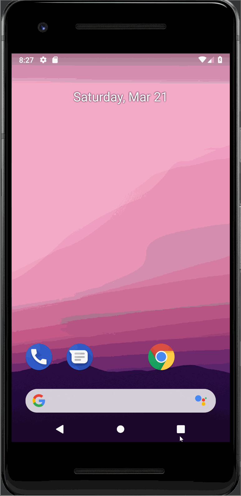

## Flashcard App

## Lab 4

### App Description
A simple flashcard app that displays a random question and three answer choices. Incorrect answers will be highlighted in red and correct answers will be highlighted in green. You can add new cards and as well as edit existing cards. Flashcards are persisted in a database so users can continue studying when they return to the app. There is a handy next button to move to a new flashcard. There is a countdown timer to make the app more fun. Styling includes card flipping and transition animations.

### App Walk-through
 

## Required
- [x] User sees a transition animation when going from the main screen to the add card screen.
- [x] User sees a reveal animation when the flashcard is tapped and the answer is shown
- [x] User sees flashcards animating in / out when the 'next' button is tapped

## Optional
- [x] Extra styling is added!
- [x] User sees a countdown timer for each question
- [x] User sees a 'card flip' animation when the card is tapped
- [x] User sees a celebration animation with confetti when they answer a question correctly

----------------------------------------------------------------------------------------------------------------------------------------
